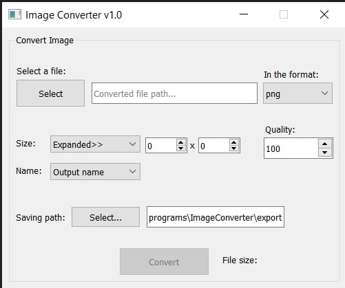

# Simple Image Converter
### This program can convert such formats as: __png, jpg, jpeg, pdf, ico, bmp, webp, tiff.__
___

## Short documentation
> You have to select image to convert and select converted format. If you want to edit __size__ or __name__ of converted file, choose corresponding item. Also __quality__ is editable. Converted files save by default path in project folder by name __"export"__.

### _P.S. (Design will be edited in soon time)_